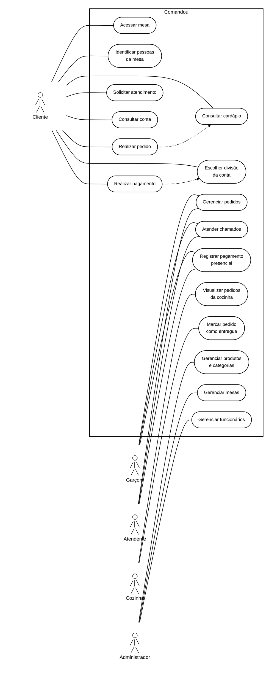

```mermaid
%%{init: {
  "theme": "base",
  "flowchart": {
    "htmlLabels": true,
    "padding": 30,
    "wrappingWidth": 300,
    "nodeSpacing": 35,
    "rankSpacing": 50
  },
  "themeVariables": {
    "background": "#ffffff",
    "primaryColor": "#ffffff",
    "primaryTextColor": "#000000",
    "primaryBorderColor": "#000000",
    "lineColor": "#000000",
    "clusterBkg": "#ffffff",
    "clusterBorder": "#000000"
  }
}}%%

flowchart LR

subgraph DIAGRAMA[" "]
direction LR

    CLIENTE["◯<br/>╱│╲<br/>╱ ╲<br/>Cliente"]
    GARCOM["◯<br/>╱│╲<br/>╱ ╲<br/>Garçom"]
    ATENDENTE["◯<br/>╱│╲<br/>╱ ╲<br/>Atendente"]
    COZINHA["◯<br/>╱│╲<br/>╱ ╲<br/>Cozinha"]
    ADMIN["◯<br/>╱│╲<br/>╱ ╲<br/>Administrador"]

    subgraph SISTEMA["Comandou"]

        ACESSAR(["Acessar mesa"])
        PESSOAS(["Identificar pessoas<br/>da mesa"])
        CARDAPIO(["Consultar cardápio"])
        PEDIDO(["Realizar pedido"])
        ATENDIMENTO(["Solicitar atendimento"])
        CONTA(["Consultar conta"])
        DIVISAO(["Escolher divisão<br/>da conta"])
        PAGAMENTO(["Realizar pagamento"])

        GERENCIARPEDIDOS(["Gerenciar pedidos"])
        CHAMADOS(["Atender chamados"])
        PAGAMENTOPRESENCIAL(["Registrar pagamento<br/>presencial"])

        VISUALIZARPEDIDOS(["Visualizar pedidos<br/>da cozinha"])
        ENTREGUE(["Marcar pedido<br/>como entregue"])

        GERENCIARCARDAPIO(["Gerenciar produtos<br/>e categorias"])
        GERENCIARMESAS(["Gerenciar mesas"])
        GERENCIARFUNCIONARIOS(["Gerenciar funcionários"])
    end

    CLIENTE --- ACESSAR
    CLIENTE --- PESSOAS
    CLIENTE --- CARDAPIO
    CLIENTE --- PEDIDO
    CLIENTE --- ATENDIMENTO
    CLIENTE --- CONTA
    CLIENTE --- DIVISAO
    CLIENTE --- PAGAMENTO

    GARCOM --- GERENCIARPEDIDOS
    GARCOM --- CHAMADOS
    GARCOM --- PAGAMENTOPRESENCIAL

    ATENDENTE --- GERENCIARPEDIDOS
    ATENDENTE --- CHAMADOS
    ATENDENTE --- PAGAMENTOPRESENCIAL

    COZINHA --- VISUALIZARPEDIDOS
    COZINHA --- ENTREGUE

    ADMIN --- GERENCIARCARDAPIO
    ADMIN --- GERENCIARMESAS
    ADMIN --- GERENCIARFUNCIONARIOS

    PEDIDO -.-> CARDAPIO
    PAGAMENTO -.-> DIVISAO

end

classDef ator fill:transparent,stroke:transparent,color:#000000,font-size:16px;
classDef caso fill:#ffffff,stroke:#000000,color:#000000,stroke-width:1.5px,font-size:15px;

class CLIENTE,GARCOM,ATENDENTE,COZINHA,ADMIN ator;
class ACESSAR,PESSOAS,CARDAPIO,PEDIDO,ATENDIMENTO,CONTA,DIVISAO,PAGAMENTO,GERENCIARPEDIDOS,CHAMADOS,PAGAMENTOPRESENCIAL,VISUALIZARPEDIDOS,ENTREGUE,GERENCIARCARDAPIO,GERENCIARMESAS,GERENCIARFUNCIONARIOS caso;

style DIAGRAMA fill:#ffffff,stroke:#ffffff,color:#000000
style SISTEMA fill:#ffffff,stroke:#000000,stroke-width:2px,color:#000000

linkStyle default stroke:#000000,stroke-width:1.5px;
```
