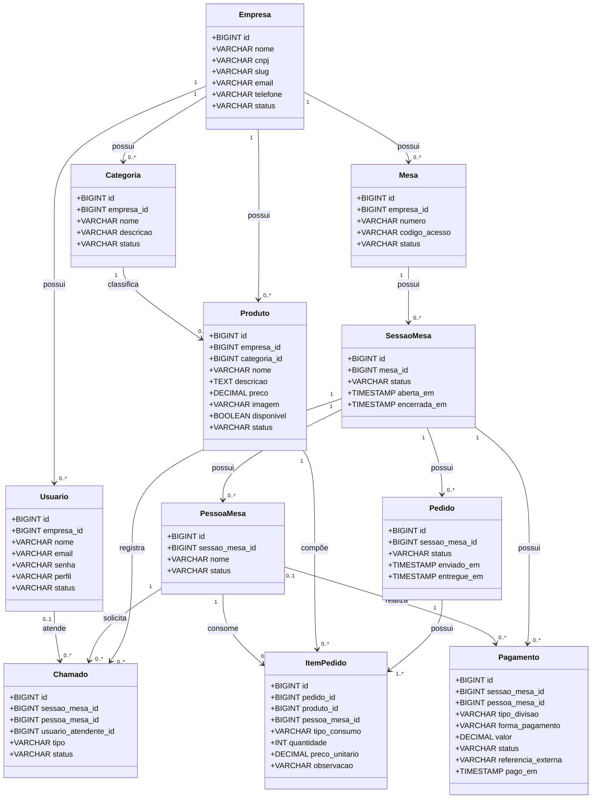

# Diagrama de Classes

O diagrama apresenta as principais classes previstas para o Comandou e seus relacionamentos.

```mermaid
classDiagram

    class Empresa {
        +BIGINT id
        +VARCHAR nome
        +VARCHAR cnpj
        +VARCHAR slug
        +VARCHAR email
        +VARCHAR telefone
        +VARCHAR status
    }

    class Usuario {
        +BIGINT id
        +BIGINT empresa_id
        +VARCHAR nome
        +VARCHAR email
        +VARCHAR senha
        +VARCHAR perfil
        +VARCHAR status
    }

    class Mesa {
        +BIGINT id
        +BIGINT empresa_id
        +VARCHAR numero
        +VARCHAR codigo_acesso
        +VARCHAR status
    }

    class SessaoMesa {
        +BIGINT id
        +BIGINT mesa_id
        +VARCHAR status
        +TIMESTAMP aberta_em
        +TIMESTAMP encerrada_em
    }

    class PessoaMesa {
        +BIGINT id
        +BIGINT sessao_mesa_id
        +VARCHAR nome
        +VARCHAR status
    }

    class Categoria {
        +BIGINT id
        +BIGINT empresa_id
        +VARCHAR nome
        +VARCHAR descricao
        +VARCHAR status
    }

    class Produto {
        +BIGINT id
        +BIGINT empresa_id
        +BIGINT categoria_id
        +VARCHAR nome
        +TEXT descricao
        +DECIMAL preco
        +VARCHAR imagem
        +BOOLEAN disponivel
        +VARCHAR status
    }

    class Pedido {
        +BIGINT id
        +BIGINT sessao_mesa_id
        +VARCHAR status
        +TIMESTAMP enviado_em
        +TIMESTAMP entregue_em
    }

    class ItemPedido {
        +BIGINT id
        +BIGINT pedido_id
        +BIGINT produto_id
        +BIGINT pessoa_mesa_id
        +VARCHAR tipo_consumo
        +INT quantidade
        +DECIMAL preco_unitario
        +VARCHAR observacao
    }

    class Chamado {
        +BIGINT id
        +BIGINT sessao_mesa_id
        +BIGINT pessoa_mesa_id
        +BIGINT usuario_atendente_id
        +VARCHAR tipo
        +VARCHAR status
    }

    class Pagamento {
        +BIGINT id
        +BIGINT sessao_mesa_id
        +BIGINT pessoa_mesa_id
        +VARCHAR tipo_divisao
        +VARCHAR forma_pagamento
        +DECIMAL valor
        +VARCHAR status
        +VARCHAR referencia_externa
        +TIMESTAMP pago_em
    }

    Empresa "1" --> "0..*" Usuario : possui
    Empresa "1" --> "0..*" Mesa : possui
    Empresa "1" --> "0..*" Categoria : possui
    Empresa "1" --> "0..*" Produto : possui

    Mesa "1" --> "0..*" SessaoMesa : possui
    SessaoMesa "1" --> "0..*" PessoaMesa : possui
    SessaoMesa "1" --> "0..*" Pedido : possui
    SessaoMesa "1" --> "0..*" Chamado : registra
    SessaoMesa "1" --> "0..*" Pagamento : possui

    Categoria "1" --> "0..*" Produto : classifica

    Pedido "1" --> "1..*" ItemPedido : possui
    Produto "1" --> "0..*" ItemPedido : compõe
    PessoaMesa "1" --> "0..*" ItemPedido : consome

    PessoaMesa "1" --> "0..*" Chamado : solicita
    Usuario "0..1" --> "0..*" Chamado : atende

    PessoaMesa "0..1" --> "0..*" Pagamento : realiza
```
