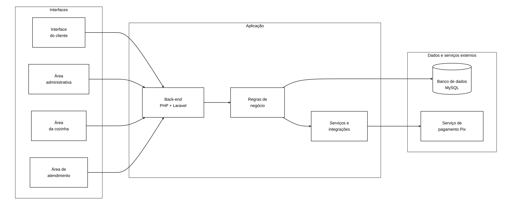

```mermaid
%%{init: {
  "theme": "base",
  "flowchart": {
    "htmlLabels": true,
    "padding": 36,
    "wrappingWidth": 320,
    "nodeSpacing": 70,
    "rankSpacing": 85,
    "useMaxWidth": false
  },
  "themeVariables": {
    "background": "#ffffff",
    "primaryColor": "#ffffff",
    "primaryTextColor": "#000000",
    "primaryBorderColor": "#000000",
    "lineColor": "#333333",
    "fontSize": "17px"
  }
}}%%

flowchart LR

subgraph DIAGRAMA[" "]
direction LR

    subgraph INTERFACES["Interfaces"]
    direction TB

        CLIENTE["Interface<br/>do cliente"]
        ADMIN["Área<br/>administrativa"]
        COZINHA["Área<br/>da cozinha"]
        ATENDIMENTO["Área de<br/>atendimento"]
    end

    subgraph BACKEND["Aplicação"]
    direction TB

        LARAVEL["Back-end<br/>PHP + Laravel"]
        REGRAS["Regras de<br/>negócio"]
        API["Serviços e<br/>integrações"]
    end

    subgraph DADOS["Dados e serviços externos"]
    direction TB

        MYSQL[("Banco de dados<br/>MySQL")]
        PAGAMENTO["Serviço de<br/>pagamento Pix"]
    end

    CLIENTE --> LARAVEL
    ADMIN --> LARAVEL
    COZINHA --> LARAVEL
    ATENDIMENTO --> LARAVEL

    LARAVEL --> REGRAS
    REGRAS --> MYSQL
    REGRAS --> API
    API --> PAGAMENTO

end

classDef componente fill:#ffffff,stroke:#000000,color:#000000,stroke-width:1.5px,font-size:17px;

class CLIENTE,ADMIN,COZINHA,ATENDIMENTO,LARAVEL,REGRAS,API,MYSQL,PAGAMENTO componente;

style DIAGRAMA fill:#ffffff,stroke:#ffffff,color:#000000
style INTERFACES fill:#ffffff,stroke:#000000,color:#000000
style BACKEND fill:#ffffff,stroke:#000000,color:#000000
style DADOS fill:#ffffff,stroke:#000000,color:#000000

linkStyle default stroke:#333333,stroke-width:2px;
```
