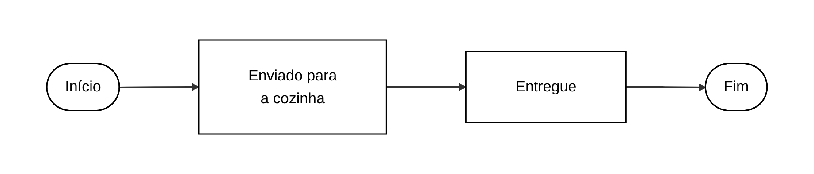
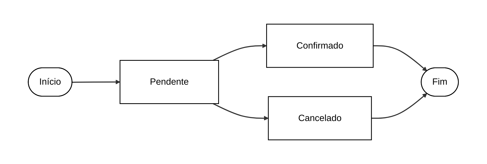
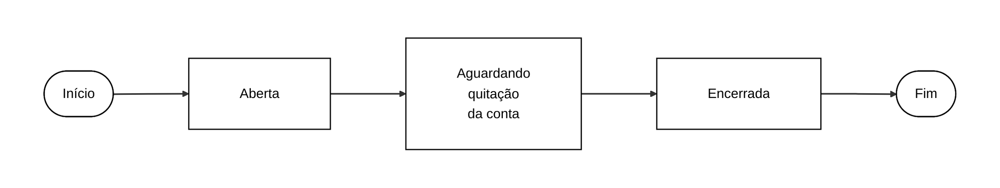
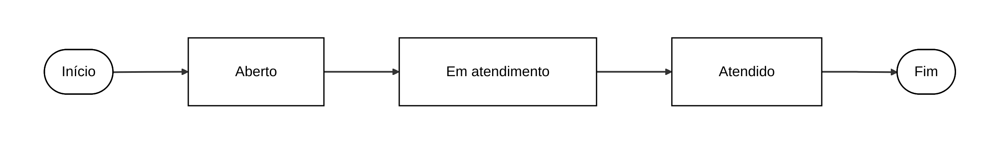

# Diagrama de Estados

Os diagramas abaixo representam as principais mudanças de estado previstas no Comandou.

## Estado do pedido

## Estado do pagamento

## Estado da sessão da mesa

## Estado do chamado

