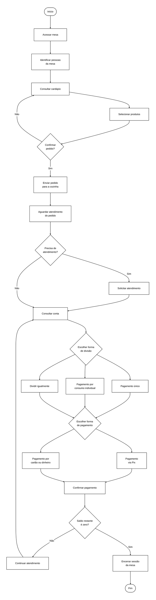

```mermaid
%%{init: {
  "theme": "base",
  "flowchart": {
    "htmlLabels": true,
    "padding": 30,
    "wrappingWidth": 280,
    "nodeSpacing": 55,
    "rankSpacing": 65,
    "useMaxWidth": false
  },
  "themeVariables": {
    "background": "#ffffff",
    "primaryColor": "#ffffff",
    "primaryTextColor": "#000000",
    "primaryBorderColor": "#000000",
    "lineColor": "#333333",
    "fontSize": "17px"
  }
}}%%

flowchart TD

subgraph DIAGRAMA[" "]
direction TD

    INICIO([Início])

    ACESSO["Acessar mesa"]
    PESSOAS["Identificar pessoas<br/>da mesa"]
    CARDAPIO["Consultar cardápio"]
    PEDIDO["Selecionar produtos"]

    CONFIRMAR{"Confirmar<br/>pedido?"}

    ENVIAR["Enviar pedido<br/>para a cozinha"]
    AGUARDAR["Aguardar atendimento<br/>do pedido"]

    CHAMAR{"Precisa de<br/>atendimento?"}
    SOLICITAR["Solicitar atendimento"]

    CONTA["Consultar conta"]

    DIVISAO{"Escolher forma<br/>de divisão"}

    UNICO["Pagamento único"]
    INDIVIDUAL["Pagamento por<br/>consumo individual"]
    IGUAL["Dividir igualmente"]

    FORMA{"Escolher forma<br/>de pagamento"}

    PIX["Pagamento<br/>via Pix"]
    PRESENCIAL["Pagamento por<br/>cartão ou dinheiro"]

    CONFIRMACAO["Confirmar pagamento"]

    SALDO{"Saldo restante<br/>é zero?"}

    CONTINUAR["Continuar atendimento"]
    ENCERRAR["Encerrar sessão<br/>da mesa"]

    FIM([Fim])

    INICIO --> ACESSO
    ACESSO --> PESSOAS
    PESSOAS --> CARDAPIO
    CARDAPIO --> PEDIDO
    PEDIDO --> CONFIRMAR

    CONFIRMAR -- Não --> CARDAPIO
    CONFIRMAR -- Sim --> ENVIAR

    ENVIAR --> AGUARDAR
    AGUARDAR --> CHAMAR

    CHAMAR -- Sim --> SOLICITAR
    SOLICITAR --> CONTA

    CHAMAR -- Não --> CONTA

    CONTA --> DIVISAO

    DIVISAO --> UNICO
    DIVISAO --> INDIVIDUAL
    DIVISAO --> IGUAL

    UNICO --> FORMA
    INDIVIDUAL --> FORMA
    IGUAL --> FORMA

    FORMA --> PIX
    FORMA --> PRESENCIAL

    PIX --> CONFIRMACAO
    PRESENCIAL --> CONFIRMACAO

    CONFIRMACAO --> SALDO

    SALDO -- Não --> CONTINUAR
    CONTINUAR --> CONTA

    SALDO -- Sim --> ENCERRAR
    ENCERRAR --> FIM

end

classDef processo fill:#ffffff,stroke:#000000,color:#000000,stroke-width:1.5px,font-size:17px;
classDef decisao fill:#ffffff,stroke:#000000,color:#000000,stroke-width:1.5px,font-size:17px;
classDef iniciofim fill:#ffffff,stroke:#000000,color:#000000,stroke-width:1.5px,font-size:17px;

class ACESSO,PESSOAS,CARDAPIO,PEDIDO,ENVIAR,AGUARDAR,SOLICITAR,CONTA,UNICO,INDIVIDUAL,IGUAL,PIX,PRESENCIAL,CONFIRMACAO,CONTINUAR,ENCERRAR processo;
class CONFIRMAR,CHAMAR,DIVISAO,FORMA,SALDO decisao;
class INICIO,FIM iniciofim;

style DIAGRAMA fill:#ffffff,stroke:#ffffff,color:#000000

linkStyle default stroke:#333333,stroke-width:2px;
```
