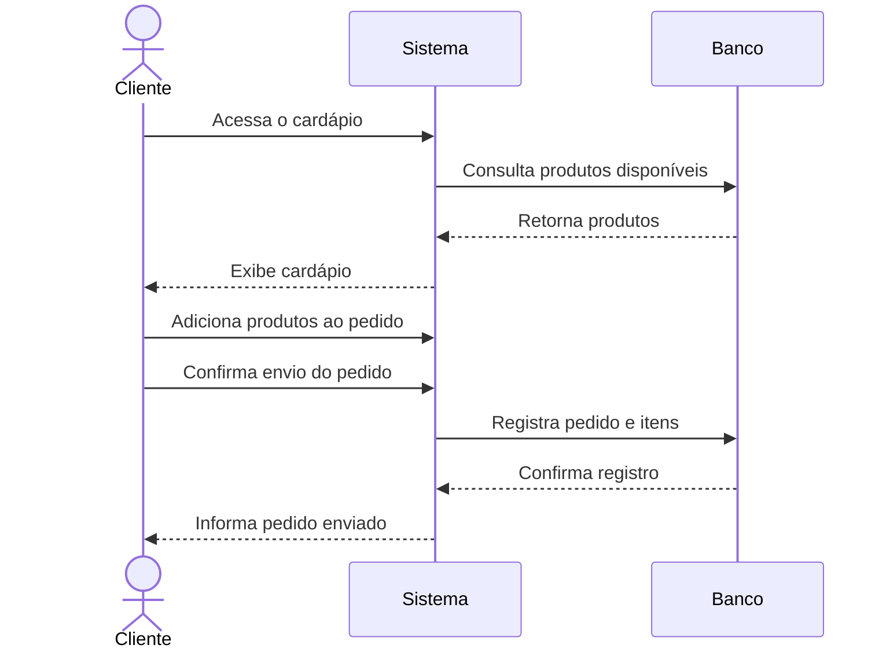
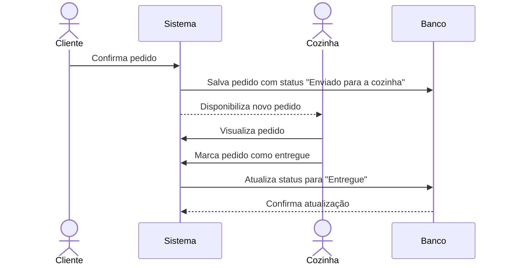
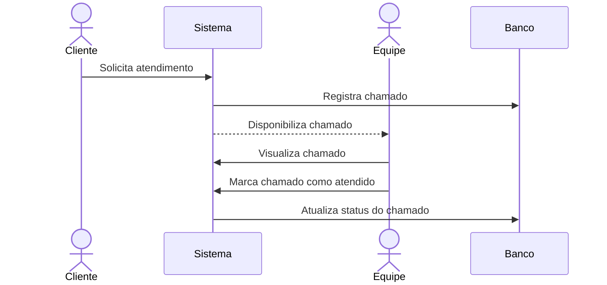
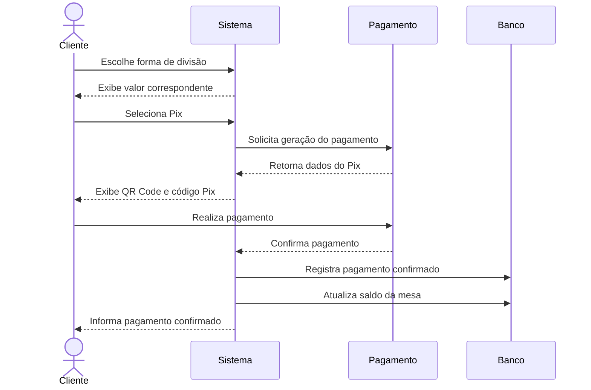
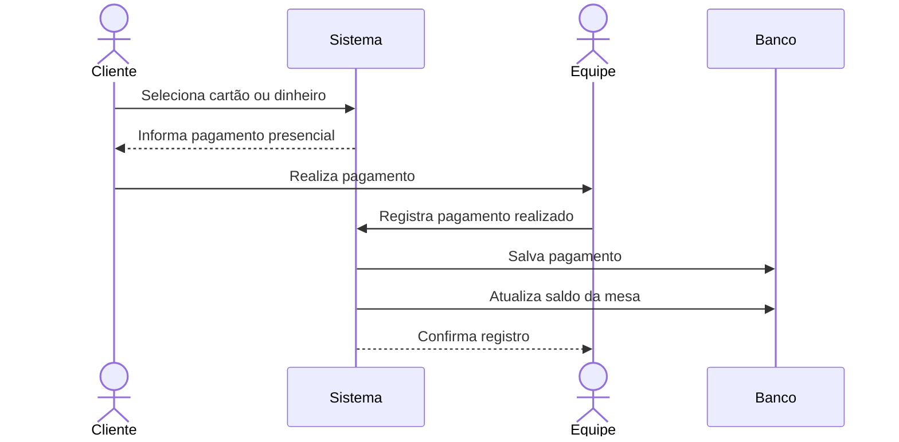

# Diagramas de Sequência

Os diagramas de sequência apresentam, de forma resumida, a ordem das interações entre os principais participantes do Comandou.

## Realização de pedido

## Envio e atualização do pedido na cozinha

## Solicitação de atendimento

## Pagamento via Pix

## Pagamento presencial

